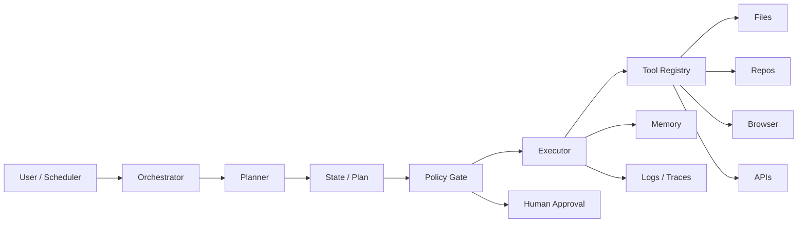

# Architecture

## Core contracts

- Planner produces `PlanStep` objects.
- Policy engine decides whether a step is allowed, blocked, or approval-gated.
- Executor runs only registered tools.
- Memory store records outcomes.
- Eval runner checks whether changes improve real task completion.

## Production additions

- LangGraph or equivalent durable orchestration
- Postgres + pgvector for memory
- OpenTelemetry/OpenInference tracing
- Browser worker sandbox
- Code execution sandbox
- Per-tool scoped secrets
- CI eval suite
