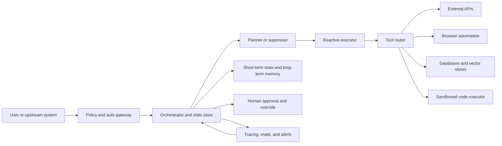
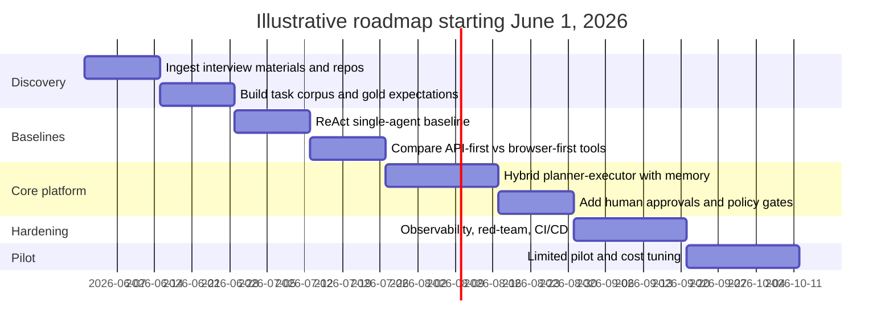

# Autonomous AI Agent Systems

## Executive summary

The strongest default for building autonomous AI agents in 2026 is not a fully free-running “agent that does everything,” but a **hybrid system**: an explicit planner or supervisor, a reactive execution loop for tools and environment interaction, persistent state and checkpoints, human-interrupt points for risky actions, and sandboxed workers for code or browser operations. That recommendation lines up with classical agent architecture literature on reactive, deliberative, and hybrid control, and with modern orchestration frameworks that emphasize durable execution, persistence, and human-in-the-loop operation. citeturn40search0turn39search1turn39search2turn39search10turn21search5turn21search2

For framework selection, the best production defaults are usually **LangChain + LangGraph** when you want a broad integration ecosystem and explicit control over stateful workflows; **CrewAI** when you want a more opinionated multi-agent experience; **LlamaIndex Workflows/Llama Agents** when the problem is document-heavy or retrieval-heavy; and **DSPy** when evaluation-driven optimization of prompts/programs is central. **AutoGen** is now in maintenance mode and points new users to Microsoft Agent Framework, **BabyAGI** explicitly presents itself as experimental and not production-ready, and **ReAct** remains a valuable reasoning pattern but not a full runtime or governance model. citeturn24view0turn23view0turn22view2turn20search13turn22view4turn21search1turn22view3turn22view1turn22view6turn37search0turn36view0

The hard part of autonomous agents is usually **systems engineering, safety, and evaluation**, not just model selection. Public benchmarks such as GAIA, WebArena, SWE-bench, and AgentBench all stress tool use, environment interaction, and long-horizon coordination. Production programs therefore need offline benchmarks, scenario tests, regression suites, security red-teaming, and telemetry for prompts, tool calls, state transitions, cost, and policy events. OpenTelemetry plus AI-specific conventions such as OpenInference, and tools such as Phoenix, Helicone, LangSmith, Inspect, Promptfoo, and DeepEval, are now established building blocks for that workflow. citeturn10search0turn10search1turn10search2turn10search3turn15search2turn16search2turn16search0turn16search3turn11search0turn11search1turn11search2turn11search11

No interview materials, repository links, or uploaded files were available in this conversation, so this report is a **public-source baseline**. It is structured so that once those materials are supplied, they can be folded into a repo-specific appendix, eval corpus, and prioritized prototype plan. Budget, timeline, and compute constraints were unspecified, so the recommendations below deliberately provide **low, medium, and high** operating envelopes.

## Scope and assumptions

This report prioritizes **primary documentation, official repositories, standards, legal texts, and original papers** over commentary. Because the promised interview materials and repositories were not yet available here, the analysis focuses on what a rigorous, updatable baseline should look like before organization-specific evidence is layered in.

| Attribute | Representative open-source repos and primary docs | Seminal papers | Representative sources |
|---|---|---|---|
| Agent architectures | `ysymyth/ReAct`, `langchain-ai/langgraph`, `crewAIInc/crewAI`, `run-llama/llama-agents` | Brooks on layered reactive control; Rao & Georgeff on BDI; Ferguson on TouringMachines; ReAct | citeturn36view0turn21search5turn22view2turn21search11turn40search0turn39search1turn39search2turn37search0 |
| Frameworks and libraries | LangChain, LangGraph, CrewAI, LlamaIndex, DSPy, AutoGPT, AutoGen, BabyAGI | DSPy optimization papers; AutoGen research project | citeturn24view0turn23view0turn22view2turn22view4turn22view3turn22view5turn22view1turn22view6turn20search12 |
| Orchestration and runtime | Docker, gVisor, Firecracker, Cloud Run, AWS Lambda, KServe, Ray Serve, Argo CD, Terraform | Firecracker NSDI paper | citeturn29search19turn27search19turn28search0turn31search4turn31search16turn31search10turn31search3turn17search1turn17search2turn28search18 |
| State management and memory | LangGraph persistence, LangChain memory concepts, MemGPT/Letta, pgvector, FAISS, Chroma, Redis vector search | Generative Agents; MemGPT | citeturn21search2turn34search3turn5search19turn5search6turn5search3turn6search4turn6search13turn6search2turn34search0 |
| Tool integration | OpenAI function calling, Playwright, Scrapy, Jupyter, SQLAlchemy, LiteLLM, vLLM, TGI, llama.cpp | Toolformer | citeturn25search2turn7search0turn7search1turn7search2turn7search3turn38search15turn38search8turn38search1turn38search2turn37search2 |
| Planning and decision-making | LangGraph planning agents, Tree-of-Thoughts repo, Voyager repo | HTN semantics; Tree of Thoughts; Reflexion; Self-Refine; Options framework; Voyager; Agent Lightning | citeturn37search3turn8search13turn9search1turn9search2turn8search1turn34search1turn34search2turn8search14turn9search15turn8search3 |
| Evaluation and testing | GAIA, SWE-bench, WebArena, AgentBench, Inspect, Promptfoo, DeepEval, LangSmith | Benchmark papers above | citeturn10search0turn10search1turn10search2turn10search3turn11search0turn11search1turn11search2turn11search11 |
| Safety, security, legal, ethics | OWASP LLM Top 10, OWASP LLMSVS, NIST AI RMF, NIST Privacy Framework, EU AI Act, GDPR, CCPA, FTC privacy guidance, U.S. Copyright Office AI report | Indirect prompt injection paper | citeturn13search1turn13search3turn13search5turn12search14turn15search9turn12search5turn15search0turn14search5turn30search1turn30search4turn13search2 |

## Architectures and reasoning loops

In classical AI terms, **reactive architectures** privilege fast response to local state; **deliberative architectures** privilege internal representation, planning, and goal decomposition; **hybrid architectures** explicitly separate those functions into layers. That old taxonomy still maps cleanly onto LLM-era systems. ReAct-style prompting is the clearest modern reactive pattern: it interleaves reasoning traces and actions, allowing the model to observe, act, and update plans in short loops. Brooks’ layered control work remains the canonical reference for reactive competence through stacked behaviors rather than centralized world modeling. citeturn40search0turn37search0turn37search1

A **deliberative agent** is the right mental model when the problem requires explicit task decomposition, resource constraints, lookahead, or a plan that must survive across many steps. BDI work formalized agents around beliefs, desires, and intentions, while HTN planning gave a crisp semantics for decomposing compound tasks into executable subtasks. In the LLM literature, Tree of Thoughts and related planner-first approaches improve performance on multi-step problems by exploring and evaluating candidate reasoning paths rather than committing to the first action sequence. citeturn39search12turn39search1turn9search2turn8search1turn37search3

For practical systems, though, **hybrid** is the default. TouringMachines and 3T-style layered control were early expressions of that idea: one layer handles reactive behavior, another handles sequencing, and another handles planning. Modern frameworks express the same pattern in software engineering terms rather than robotics terms. LangGraph positions itself as a stateful orchestration runtime with durable execution, persistence, and human-in-the-loop; CrewAI says Flows own state and execution order while agents do the work; Llama Agents/Workflows describe themselves as event-driven and async-first. Those are all modern hybrid agent runtimes in spirit. citeturn39search2turn39search10turn39search8turn21search5turn21search2turn20search13turn21search11

A good production architecture therefore looks like this:

Planning inside that architecture should stay **as simple as the task allows**. ReAct works well for short-horizon workflows and tool-rich answering. HTN-style decomposition or plan-and-execute patterns are better for repo work, multi-document synthesis, or long browser sessions. Tree-of-Thoughts is useful when search over alternative reasoning paths matters. Reflexion and Self-Refine are good when repeated attempts and feedback materially improve quality. RL-based fine-tuning should come **after** prompt/program optimization and only when rewards are measurable, trajectories are logged, and the domain has enough repetition to justify the added complexity. The options framework, Voyager, and Agent Lightning are the most relevant primary references for that step. citeturn37search0turn37search3turn8search1turn34search1turn34search2turn8search14turn9search15turn8search3

## Frameworks and repositories

The table below compares the most relevant candidate frameworks and reference repositories for building autonomous agents today.

| Candidate | Core abstraction | Distinguishing strengths | Maturity and community | Best fit | Main caution | Primary sources |
|---|---|---|---|---|---|---|
| LangChain + LangGraph | LangChain handles integrations and agent components; LangGraph handles stateful orchestration | Broad ecosystem, durable execution, persistence, human-in-the-loop, deployable long-running workflows | Very high; LangChain shows **138k stars** and active May 2026 releases, while LangGraph shows **32.9k stars** and active May 2026 releases | Best general default for production Python/TS agents | More primitives and explicit graph design than “magic” agent wrappers | citeturn24view0turn23view0turn21search2turn21search5 |
| CrewAI | Crews for agent teams, Flows for state and execution order | Opinionated multi-agent flow model, enterprise-facing control plane, tracing | High; **52.2k stars** and a May 2026 release; docs explicitly recommend Flows for production apps | Teams that want a clearer multi-agent mental model out of the box | More framework-specific abstractions; less neutral than LangGraph | citeturn22view2turn23view2turn20search13 |
| LlamaIndex Workflows / Llama Agents | Event-driven workflows plus document-centric agent stack | Excellent for document-heavy agents, retrieval, parsing, indexing, 300+ integrations | High; **49.7k stars** and active ecosystem growth | Knowledge assistants, document agents, RAG-heavy workflows | Most compelling when documents/context management are central | citeturn22view4turn23view3turn21search1turn21search11 |
| DSPy | Declarative AI programming with optimization/compilation | Strong for eval-driven optimization, prompt and weight tuning, modular LM programs | High research maturity; **34.6k stars** and a substantial paper trail on optimization | Teams who treat prompting as a compile/optimize problem | Not a complete runtime/governance layer by itself | citeturn22view3turn20search6 |
| AutoGPT | Platform for creating, deploying, and managing continuous agents | Popular reference platform, low-code/front-end angle, continuous automation focus | Very large community; **185k stars** and active May 2026 release | Reference platform, demos, platform experimentation | Heavier than a minimal kernel; less attractive than cleaner orchestration-first stacks for a fresh build | citeturn22view5turn23view4 |
| AutoGen | Multi-agent framework from Microsoft Research | Historically influential for multi-agent patterns and research | Large installed base at **58.4k stars**, but now **maintenance mode** | Legacy users and comparative research | New users are directed elsewhere; not a greenfield default | citeturn22view1turn23view1turn20search12 |
| BabyAGI | Experimental self-building agent framework | Historically important as a planning meme/reference | Moderate community at **22.3k stars** | Ideation, experimentation, historical context | Explicitly says it is experimental and not meant for production | citeturn22view6turn23view5 |
| ReAct | Prompting pattern and research repo | Strong reasoning-plus-acting baseline; still the core inner loop for many systems | Research reference; **3.9k stars**, small repo, limited runtime surface | Inner-loop reasoning pattern inside a larger runtime | It is a pattern, not a production platform | citeturn36view0turn37search0 |

The selection logic is fairly simple. If you need the most balanced production starting point, **LangGraph plus LangChain** is the safest baseline because it separates orchestration from integrations and explicitly supports persistence and interruption. If your primary workload is multi-agent business automation, **CrewAI** deserves a serious pilot. If your core problem is over documents, knowledge bases, and long-horizon context management, **LlamaIndex** is unusually strong. If the program will live or die on measured optimization and reproducible prompt/program improvement, **DSPy** is the best specialist addition. **AutoGPT**, **AutoGen**, **BabyAGI**, and standalone **ReAct** are better treated as references than as the default foundation for a new production build. citeturn24view0turn23view0turn22view2turn22view4turn22view3turn22view1turn22view6turn36view0

## Runtime, memory, and tool integration

For execution infrastructure, the baseline is still **containers**, but not all agent tasks should run with the same trust level. Docker remains the common packaging layer; gVisor provides a stronger isolation layer for containerized workloads; Firecracker provides microVM-based isolation for multi-tenant or particularly risky tasks; and Nitro Enclaves are relevant when a parent EC2 host needs an isolated environment with no external networking or persistent storage for especially sensitive operations. For any agent that can execute code, handle arbitrary files, or browse untrusted content, that extra isolation is not optional ambiance; it is core architecture. citeturn29search19turn27search19turn27search1turn28search0turn28search3turn28search1

For platform orchestration, **Kubernetes** earns its keep when you need multiple services, explicit policy, tenant segmentation, workload scheduling, GitOps, or self-hosted model serving. The surrounding controls matter as much as the scheduler: Kubernetes RBAC, NetworkPolicies, Argo CD, and Terraform are the backbone of a serious deployment posture. If you choose EKS, remember that AWS prices the control plane at **$0.10 per hour** in standard support and **$0.60 per hour** in extended support, so lifecycle discipline is part of cost control as well as security hygiene. KServe and Ray Serve are strong self-hosted options for serving models or agent backends at scale on Kubernetes. citeturn27search2turn29search2turn17search1turn17search2turn32view2turn31search10turn31search3turn31search14

When the workload is bursty, stateless, or heavily event-driven, **serverless** is often better. Cloud Run describes itself as a fully managed serverless platform for running containers behind requests or events, and AWS Lambda is the analogous pay-per-use code execution model on AWS. The most successful agent deployments often end up hybrid here too: a stateful control plane for orchestration and memory, plus serverless workers for bounded tasks like parsing, summarization, queue consumers, or low-risk tool adapters. citeturn31search4turn31search15turn31search9turn31search16

For state, a production agent should distinguish at least four layers: **working state for the current run, conversational/thread memory, durable task checkpoints, and external retrieval memory**. LangGraph’s persistence model saves graph state as checkpoints at every step, and LangChain’s memory concepts explicitly separate short-term thread-scoped memory from long-term memory across sessions. MemGPT and Letta push this further into tiered memory management for persistent agents. For external memory, the most practical default options remain Postgres plus pgvector for operational simplicity, FAISS for raw vector search performance, and Chroma or Redis when you want more specialized search behavior or developer convenience. citeturn21search2turn34search3turn5search19turn5search6turn5search3turn6search4turn6search13turn6search2

For tools, the design rule is **API-first, browser-second, scraping-third**. Structured tool calling lets the model choose actions while your application remains the real executor and policy enforcement point. OpenAI’s function calling guide captures that pattern well: tools are defined by a schema, the model emits an intended call, and the application decides whether, how, and under what permissions to execute it. When no reliable API exists, Playwright is a strong browser automation layer; Scrapy is still the workhorse for large-scale extraction; Jupyter remains excellent for prototyping and analyst workflows; and SQLAlchemy is a stable abstraction for relational databases. Multi-provider routing can be normalized with LiteLLM, while self-hosted inference is best served by vLLM, Hugging Face TGI, or llama.cpp depending whether the target is high-throughput server inference or lightweight local/edge execution. citeturn25search2turn7search0turn7search1turn7search2turn7search3turn38search15turn38search8turn38search1turn38search2

## Evaluation, safety, observability, and governance

Autonomous agents should be evaluated along at least three layers: **public benchmark performance, organization-specific scenario tests, and production trace quality**. The benchmark layer is valuable because each benchmark stresses a different failure mode.

| Benchmark | What it measures | When it is most useful | Primary sources |
|---|---|---|---|
| GAIA | Real-world assistant tasks requiring reasoning, tool use, web browsing, and multimodal handling | General-purpose research or knowledge-work agents | citeturn10search0 |
| WebArena | Realistic browser interaction in self-hostable web environments | Browser agents and GUI automation | citeturn10search2 |
| SWE-bench | Real-world GitHub issue resolution over codebases | Repo-editing and coding agents | citeturn10search1turn10search13 |
| AgentBench | Multi-environment evaluation for decision making and agent behavior | Comparative testing across heterogeneous agent tasks | citeturn10search3turn10search15 |

Those external benchmarks are necessary but not sufficient. A production program should add a private evaluation suite using **Inspect**, **Promptfoo**, **DeepEval**, or **LangSmith**. In practice, the most decision-useful metrics are task completion rate, exact-match success where deterministic scoring is possible, cost per successful task, latency, retry rate, handoff rate to humans, unauthorized tool-call rate, and prompt-injection success rate. LangSmith’s lifecycle framing—pre-deployment testing, online evaluators, real-time monitoring, and feedback loops—is especially useful as an operating model even if you use a different vendor stack. citeturn11search0turn11search1turn11search2turn11search3turn11search11

On safety, OWASP’s current LLM guidance is a strong baseline: **prompt injection is now explicitly LLM01**, and the LLMSVS project exists specifically to structure how LLM-backed systems are designed, built, and tested. The indirect prompt injection paper remains the essential conceptual warning: once an agent consumes untrusted retrieved content, the boundary between “data” and “instructions” becomes porous. Google’s layered-defense note is useful because it reinforces the correct response: do not rely on a single prompt hardening trick. Use model hardening, content classification, tool-specific guards, least privilege, and system-level segmentation together. citeturn13search1turn13search3turn13search5turn13search2turn13search10

That safety model has concrete infrastructure implications. Code execution should run in sandboxed containers or microVMs; database access should use scoped credentials, row-level security, and modern password auth; cluster permissions should be governed via RBAC and NetworkPolicies; and browser or scraping workers should run with sharply bounded egress and secrets exposure. PostgreSQL’s row security and SCRAM-SHA-256 support, Kubernetes RBAC and NetworkPolicies, and low-level Linux hardening mechanisms such as seccomp are all directly relevant here. citeturn29search0turn29search1turn27search2turn29search2turn28search2turn27search19turn28search0

Observability should be treated as part of the product, not post-facto debugging. **OpenTelemetry** is now the default vendor-neutral telemetry substrate, and **OpenInference** adds AI-specific tracing conventions on top of it. Phoenix, Helicone, and LangSmith sit at different points on the spectrum between open observability, gateway analytics, evaluation, and managed developer tooling, but the architecture should remain the same: every model call, retrieval, tool decision, policy evaluation, and state transition should emit structured telemetry with request IDs and user/task provenance where policy allows. citeturn15search2turn15search13turn16search2turn16search18turn16search0turn16search4turn16search3turn11search11

The legal and ethical layer is not decorative. The **EU AI Act** creates a risk-based regulatory structure for AI systems; **GDPR** and **CCPA** govern personal data handling; **NIST AI RMF** and the **NIST Privacy Framework** provide useful operating models for trustworthy AI and privacy risk management; the **FTC** continues to frame undisclosed or misleading data practices as consumer-protection problems; and the **U.S. Copyright Office** has stated in its AI report that some commercial uses of copyrighted works for generative AI training may not be defensible as fair use. For agent programs that browse, scrape, summarize, or learn from enterprise data, the practical implications are straightforward: collect less, store less, segregate tenants, define retention windows, document lawful bases and usage disclosures, and keep a human-accountable approval path for high-risk actions. This is not legal advice, but it is the current primary-source compliance perimeter. citeturn12search5turn15search0turn14search5turn12search14turn15search9turn30search1turn30search5turn30search0turn30search4

## Cost envelopes and resource requirements

Because your budget, timeline, and compute constraints are unspecified, the most honest way to size an autonomous-agent program is by **operating envelope** rather than pretending there is one “correct” number.

| Envelope | Typical technical shape | Resource pattern | Indicative cost anchors | Sensible use |
|---|---|---|---|---|
| Low | One stateful control-plane service, API-first tools, Postgres/pgvector or FAISS, serverless workers, hosted models | 1–2 engineers; modest CPU footprint; if self-hosting a platform like AutoGPT, its repo recommends **4+ CPU cores**, **8 GB minimum / 16 GB recommended RAM**, and **10 GB** free storage | Cloud Run’s lightweight function example is **$7.25/mo** and its CPU-intensive single-instance example is **$81.72/mo**; AutoGPT documents modest self-host minimums | Fast prototype, internal demo, early eval harness | citeturn22view5turn32view4 |
| Medium | Hybrid control plane, observability, private eval suite, multiple workers, managed DB/vector store, maybe one GPU endpoint or modest Kubernetes footprint | 2–5 engineers; small platform team | EKS control plane is about **$73/mo** in standard support; a Cloud Run L4 local-model example is **$822.40/mo** | Pilot with real users, controlled external actions | citeturn32view2turn32view4 |
| High | Multi-environment platform, HA databases, GitOps, security review, red-team suite, self-hosted inference or expensive frontier APIs, sandbox fleet | 5+ engineers across app, platform, security, QA | Several GPU endpoints plus cluster overhead, costlier models, and governance overhead can push spending into high four or five figures quickly | Revenue-bearing or regulated production system | citeturn32view2turn32view4turn33view0turn32view1 |

For model spend, an illustrative **25,000-input-token / 7,500-output-token** task produces very different economics depending on the model tier. Using officially listed token prices, the model-only cost is roughly **$0.0525** on **gpt-5.4-mini**, **$0.0625** on **Claude Haiku 4.5**, **$0.1875** on **Claude Sonnet 4.6**, and **$0.35** on **gpt-5.5**. OpenAI also lists **web search at $10 per 1,000 calls** and **hosted shell/code-interpreter sessions from $0.03 per 20-minute 1 GB container**, so aggressive tool use can dominate cost even before you count storage and observability. Those figures are not guesses; they are direct arithmetic over the current provider pricing tables. citeturn33view0turn32view1turn33view3

The practical implication is that the cheapest path is usually **not** “run the smartest model for every step.” It is to reserve expensive planning or review passes for a small fraction of turns, use cheaper models or deterministic code for routine transformations, cache stable context, prefer structured APIs over browser steps, and evaluate whether serverless billing beats always-on GPU serving for your traffic profile. OpenAI’s Batch/Flex rates and Anthropic’s prompt-caching prices reinforce the same point: cost management is fundamentally an architectural concern. citeturn33view0turn32view1

## Roadmap and artifact checklist

The highest-leverage next move is to turn your eventual interview materials and repositories into a **measurable task corpus** before attempting fancy autonomy. The roadmap below assumes a kickoff on **June 1, 2026** and is deliberately front-loaded toward corpus building, evaluation, and safety.

| Milestone | What to build | Required skills | Success criteria |
|---|---|---|---|
| Corpus and repo audit | Parse interview transcripts, extract entities/decisions, inventory repos, identify tool surfaces, and convert recurring workflows into benchmark tasks | Product researcher, software engineer, domain SME | At least 30–50 real tasks, each with a clear goal, allowed tools, and expected outcome |
| Baseline agent bakeoff | Implement a minimal ReAct agent and compare it with a planner-executor baseline on the private task corpus | Python engineer, prompt engineer, QA | Clear choice of baseline architecture based on success rate, cost, and failure analysis rather than taste |
| Hybrid platform prototype | Add explicit planning, checkpointed state, memory, retries, and bounded tool execution | Backend engineer, platform engineer | Measurable lift over baseline with lower retry chaos and better recoverability |
| Safety and observability layer | Add policy gateway, secret scoping, prompt-injection tests, telemetry, dashboards, and trace review | Security engineer, platform engineer, QA | No uncontrolled code execution path; every tool action traceable; red-team suite in CI |
| Pilot deployment | Run with real users or shadow traffic, collect traces, refine prompts/policies/tooling | Product owner, support/ops, engineering | Stable task completion, acceptable latency/cost, and documented handoff rules for humans |

If I were prioritizing experiments strictly by return on learning, I would run them in this order. First, compare **ReAct vs. plan-execute vs. hybrid** on your private tasks. Second, compare **API-first tooling vs. browser automation** for the same workflows. Third, compare **lightweight memory** against **richer long-term memory** to see whether recall actually lifts outcomes, or just increases token spend and confusion. Fourth, add **security tests** for prompt injection, unauthorized tool use, and data leakage. Fifth, only after the above stabilizes, test **reflection or RL-style improvements** such as Reflexion-style retries or a small RL loop on high-volume repeated tasks. The general rule is simple: **do not optimize a system you cannot yet evaluate or secure**. citeturn37search0turn37search3turn34search1turn8search3turn13search2turn13search3

The artifact checklist should be concrete:

- a corpus manifest for all interview materials, repos, and documents
- a repo architecture inventory and dependency graph
- a private benchmark set with gold answers or deterministic scorers
- a tool registry with ownership, auth model, rate limits, and failure semantics
- a state schema covering thread state, checkpoints, long-term memory, and provenance
- a sandbox image or microVM profile for code execution
- an observability schema for prompts, traces, tool calls, policy events, and costs
- a red-team suite for prompt injection, indirect prompt injection, secrets leakage, and unsafe tool invocation
- a deployment pipeline with GitHub Actions, Terraform, and GitOps promotion rules
- a compliance memo covering data classes, retention, user disclosures, and approval paths
- runbooks for rollback, human takeover, provider outage, and budget overrun

The recommended next step, once links or files are available, is to make the report **organization-specific** in one pass: ingest the interview materials, map the repositories, generate the private eval corpus, and then rerun the framework/runtime comparison against those real tasks. That is the point where this public baseline turns into an actionable program design.